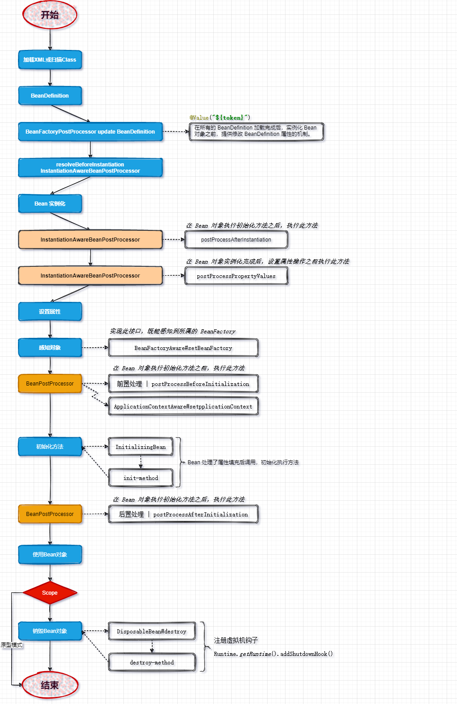

# Mini-Spring

## bean的生命周期




## IOC

### 最简单的bean容器

BeanFactory

- 保存bean，beanMap
- 注册bean，registerBean
- 获取bean，getBean


### bean容器实现

只能实例无参构造方法的bean

- BeanDefinition，顾名思义，用于定义bean信息的类，包含bean的class类型、构造参数、属性值等信息，每个bean对应一个BeanDefinition的实例。简化BeanDefinition仅包含bean的class类型。
- BeanDefinitionRegistry，BeanDefinition注册表接口，定义注册BeanDefinition的方法。
- SingletonBeanRegistry及其实现类DefaultSingletonBeanRegistry，定义添加和获取单例bean的方法。

bean容器作为BeanDefinitionRegistry和SingletonBeanRegistry的实现类，具备两者的能力。向bean容器中注册BeanDefinition后，使用bean时才会实例化。


### bean实例化策略

- **InstantiationStrategy**：bean实例化策略接口
  - Simple（简单对象实例化策略，不支持方法注入）：如果在映像构建的上下文中或在映像运行期间调用，使用SimpleInstantiationStrategy，
  - Cglib（默认对象实例化策略）：如果方法需要被容器覆盖以实现方法注入，则使用 CGLIB 动态生成子类。
- **SimpleInstantiationStrategy**：使用bean的构造函数来实例化
- **CglibSubclassingInstantiationStrategy**：使用Cglib动态生成子类
  - Enhancer是一个非常重要的类，它允许为非接口类型创建一个JAVA代理，Enhancer动态的创建给定类的子类并且拦截代理类的所有的方法
  - NoOp回调把对方法调用直接委派到这个方法在父类中的实现（也可以理解成真实对象直接调用方法）;


### 为bean填充属性，为bean注入bean

- PropertyValue：Bean属性信息，BeanDefinition中存放PropertyValue的List
- 创建Bean时，需给Bean设置属性信息
- BeanReference：Bean的引用，一个Bean引用其它Bean时引用的封装


### io（资源和资源加载器）& 在xml中定义bean & 接口继承层次

- 资源和资源加载器

- xml中定义bean

  - 在xml格式配置文件中声明式地定义bean的信息，资源加载器读取xml文件，解析出bean的信息，然后往容器中注册BeanDefinition。
  - BeanDefinitionReader是读取bean定义信息的抽象接口，XmlBeanDefinitionReader是从xml文件中读取的实现类。BeanDefinitionReader需要有获取资源的能力，且读取bean定义信息后需要往容器中注册BeanDefinition，因此BeanDefinitionReader的抽象实现类AbstractBeanDefinitionReader拥有ResourceLoader和BeanDefinitionRegistry两个属性。
  - 由于从xml文件中读取的内容是String类型，所以属性仅支持String类型和引用其他Bean。后面会讲到属性编辑器PropertyEditor，实现类型转换。

- 接口继承层次

  


### 容器扩展机制

> - **BeanFactoryPostProcessor**：允许我们在bean**实例化之前**修改bean的定义信息（BeanDefinition的信息）
>   - PropertyPlaceholderConfigurer的作用是用properties文件的配置值替换xml文件中的占位符，
>   - CustomEditorConfigurer的作用是实现类型转换
>
> - **BeanPostProcessor**：允许在bean实例化后修改bean或替换bean。BeanPostProcessor是后面实现**AOP**的关键。
>   - 两个方法分别在bean执行初始化方法（后面实现）之前和之后执行


### 应用上下文

> ApplicationContext
>
> - 比BeanFactory更为先进的IOC容器，拥有BeanFactory的所有功能
> - 支持特殊类型bean，BeanFactoryPostProcessor和BeanPostProcessor的自动识别、资源加载、容器事件和监听器、国际化支持、单例bean自动初始化等。
>
> BeanFactory是spring的基础设施，面向spring本身；而ApplicationContext面向spring的使用者，应用场合使用ApplicationContext。


### bean的初始化和销毁方法

> spring中，定义bean的初始化和销毁方法有三种方法（按执行顺序）：
>
> - 在方法上加注解PostConstruct和PreDestroy
> - 继承自InitializingBean和DisposableBean
> - 在xml文件中制定init-method和destroy-method
>
> 第三种通过BeanPostProcessor实现，在扩展篇中实现，本节只实现前两种


### Aware接口

> Aware是感知、意识的意思，Aware接口是标记性接口，其实现子类能感知容器相关的对象
>
> - BeanFactoryAware：让其实现类能感知所属的BeanFactory（initializeBean时设置）
> - ApplicationContextAware：让其实现类能感知ApplicationContext，是通过BeanPostProcessor设置，在refresh()时添加该processor


### bean作用域，增加prototype的支持

> 默认是singleton
>
> prototype**每次**向容器获取prototype作用域bean时，容器**都会创建一个新的**实例
>
> - 创建时不往singletonObjects中增加（doCreateBean）
> - 不执行销毁方法（registerDisposableBeanIfNecessary）


### FactoryBean

> FactoryBean是一种特殊的bean，当向容器获取该bean时，容器不是返回其本身，而是返回其FactoryBean#getObject方法的返回值，可通过编码方式定义复杂的bean
>
> - 当容器发现bean为FactoryBean类型时，调用其getObject方法返回最终bean
> - 当FactoryBean作用域是singleton时，将最终bean放进缓存中，下次从缓存中获取。

bean最终是通过实现的getObject方法得出


### 容器事件和事件监听器

> 事件发布和事件监听功能
>
> - ApplicationEventMulticaster（事件广播器）：注册监听器和发布事件的抽象接口
> - ContextRefreshedEvent：容器刷新事件
> - ContextClosedEvent：容器关闭事件
>   - refresh方法中，会实例化ApplicationEventMulticaster、注册监听器并发布容器刷新事件
>   - doClose方法中，发布容器关闭事件ContextClosedEvent


## AOP

### 切点表达式

> JoinPoint：织入点，指需要执行代理操作的某个类的某个方法
>
> Pointcut：JoinPoint的表述方式，能捕获JoinPoint
>
> ClassFilter：匹配类
>
> MethodMatcher：匹配方法
>
> AspectJExpressionPointcut：简单实现

利用hutools工具类


### 基于JDK的动态代理

> AopProxy：获取代理对象的接口
>
> JdkDynamicAopProxy：基于JDK动态代理的具体实现
>
> TargetSource：被代理对象的封装
>
> MethodInterceptor：方法拦截器，可在被代理执行的方法前后增加代理行为
>
> AdvisedSupport：代理支持类，存储被代理对象的封装、方法匹配器、方法拦截器

被代理类需实现接口


### 基于Cglib的动态代理

> 基于CGLIB的动态代理能在运行期间动态构建字节码的class文件，为类生成子类，因此被代理类不需要继承自任何接口
>
> CglibAopProxy：基于Cglib的动态代理


### AOP代理工厂

> ProxyFactory：AOP代理工厂，由AdvisedSupport#proxyTargetClass属性决定使用JDK动态代理还是CGLIB动态代理。


### 常用的Advice

> Spring将AOP联盟中的Advice细化出各种类型的Advice，通过扩展MethodInterceptor来实现
>
> BeforeAdivce：前置通知接口，方法执行前
>
> MethodBeforeAdvice：方法前置通知接口，定义before方法
>
> MethodBeforeAdviceInterceptor：前置通知拦截器实现


### PointcutAdvisor：Pointcut和Advice的组合

> Advisor是包含一个Pointcut和一个Advice的组合，Pointcut用于捕获JoinPoint，Advice决定在JoinPoint执行某种操作。实现了一个支持aspectj表达式的AspectJExpressionPointcutAdvisor
>
> - 支持aspectj表达式的切点顾问，切点和通知的组合


### 动态代理融入Bean生命周期

> InstantiationAwareBeanPostProcessor：可生成代理对象
>
> DefaultAdvisorAutoProxyCreator：实现上面的接口，默认的顾问自动代理创建者，在bean实例化之前执行创建代理对象返回
>
> 【Todo：aopService未放入singletonObjects中】：已解决，织入逻辑从【实例化之前】移到【初始化之后】


### 流程：

```java
[ refresh ] 
---> [ create defaultListableBeanFactory ] 
---> [ read xml && load beanDefinitions ] 
---> [ invoke beanFactoryPostProcessor ] 
---> [ register beanPostProcessors ] 
-------> [ get bean: defaultAdvisorAutoProxyCreator ]
----------> [ create bean: defaultAdvisorAutoProxyCreator ]
--------------> [ cglib create DefaultAdvisorAutoProxyCreator instance ]
--------------> [ apply propertyValues ]
--------------> [ initialize defaultAdvisorAutoProxyCreator ]
------------------> [ set beanFactory ]
------------------> [ invoke initMethods ]
---> [ init ApplicationEventMulticaster ] 
---> [ register ApplicationListeners ] 
-------> [ get bean: contextClosedEventListener ]
----------> [ create bean: contextClosedEventListener ]
------------------> [ postProcess before instantiation (autoProxy) ]
-------> [ get bean: pointcutAdvisor ]
----------> [ create bean: pointcutAdvisor ]
--------------> [ cglib create AspectjExpressionPointcutAdvisor instance ]
--------------> [ apply propertyValues ]
-------> [ ref bean: methodInterceptor ]
-------> [ get bean: methodInterceptor ]
----------> [ create bean: methodInterceptor ]
--------------> [ cglib create MethodBeforeAdviceInterceptor instance ]
--------------> [ apply propertyValues ]
-------> [ ref bean: beforeAdvice ]
-------> [ get bean: beforeAdvice ]
----------> [ create bean: beforeAdvice ]
--------------> [ cglib create AopServiceBefore instance ]
--------------> [ apply propertyValues ]
--------------> [ initialize beforeAdvice ]
------------------> [ invoke initMethods ]
--------------> [ initialize methodInterceptor ]
------------------> [ invoke initMethods ]
--------------> [ initialize pointcutAdvisor ]
------------------> [ invoke initMethods ]
--------------> [ cglib create ContextClosedEventListener instance ]
--------------> [ apply propertyValues ]
--------------> [ initialize contextClosedEventListener ]
------------------> [ invoke initMethods ]
-------> [ get bean: contextRefreshedEventListener ]
----------> [ create bean: contextRefreshedEventListener ]
------------------> [ postProcess before instantiation (autoProxy) ]
-------> [ get bean: pointcutAdvisor ]
--------------> [ cglib create ContextRefreshedEventListener instance ]
--------------> [ apply propertyValues ]
--------------> [ initialize contextRefreshedEventListener ]
------------------> [ invoke initMethods ]
---> [ pre instantiation Singletons ] 
-------> [ get bean: pointcutAdvisor ]
-------> [ get bean: contextClosedEventListener ]
-------> [ get bean: methodInterceptor ]
-------> [ get bean: defaultAdvisorAutoProxyCreator ]
-------> [ get bean: contextRefreshedEventListener ]
-------> [ get bean: aopService ]
----------> [ create bean: aopService ]
------------------> [ postProcess before instantiation (autoProxy) ]
-------> [ get bean: pointcutAdvisor ]
-------> [ cglib aop AopService ]
-------> [ get bean: beforeAdvice ]
---> [ publish ContextRefreshedEvent ]

======= refreshed listener : test start =======
-------> [ get bean: aopService ]
----------> [ create bean: aopService ]
------------------> [ postProcess before instantiation (autoProxy) ]
-------> [ get bean: pointcutAdvisor ]
-------> [ cglib aop AopService ]
[ before advice ]
[ print aop ]
[ do close ]
---> [ publish ContextClosedEvent ]
======= closed listener : test stop =======

```


## 扩展

### XML占位符引用

> PropertyPlaceholderConfigurer：占位符替换，通过继承BeanFactoryPostProcessor对BeanDefinition操作


### 包扫描

> 扫描特定注解的类，提取类的相关信息组装成BeanDefinition注册到容器中。
>
> - XmlBeanDefinitionReader中解析`<context:component-scan />`标签
> - ClassPathBeanDefinitionScanner#doScan：扫描类组装BeanDefinition然后注册到容器中


### @Value & @Autowired & @Qualifier注解

> - 通过InstantiationAwareBeanPostProcessor#postProcessPropertyValues实现
>   - bean实例化之后设置属性之前执行
>   - @Value & @Autowired & @Qualifier注解实现
> - AutowiredAnnotationBeanPostProcessor：自动装配注解BeanPostProcessor，doScan时添加到容器
> - 字符解析器StringValueResolver在PropertyPlaceholderConfigurer中添加到BeanFactory中

#### 流程

```java
[ refresh ] 
---> [ create defaultListableBeanFactory ] 
---> [ read xml && load beanDefinitions ] 
-------> [ scan package: com.kiligz ]
---> [ invoke beanFactoryPostProcessor ] 
-------> [ get bean: propertyPlaceholderConfigurer ]
----------> [ create bean: propertyPlaceholderConfigurer ]
--------------> [ cglib create PropertyPlaceholderConfigurer instance ]
--------------> [ apply PropertyValues ]
--------------> [ initialize propertyPlaceholderConfigurer ]
------------------> [ invoke initMethods ]
-------> [ replace xml placeholder ]
---> [ register beanPostProcessors ] 
-------> [ get bean: autowiredAnnotationBeanPostProcessor ]
----------> [ create bean: autowiredAnnotationBeanPostProcessor ]
--------------> [ cglib create AutowiredAnnotationBeanPostProcessor instance ]
--------------> [ apply PropertyValues ]
--------------> [ initialize autowiredAnnotationBeanPostProcessor ]
------------------> [ set beanFactory ]
------------------> [ invoke initMethods ]
---> [ init ApplicationEventMulticaster ] 
---> [ register ApplicationListeners ] 
---> [ pre instantiation Singletons ] 
-------> [ get bean: ivanService ]
----------> [ create bean: ivanService ]
--------------> [ cglib create IvanService instance ]
--------------> [ process PropertyValues ]
------------------> [ process @Autowired annotation ]
--------------> [ apply PropertyValues ]
-------> [ ref bean: ivan ]
-------> [ get bean: ivan ]
----------> [ create bean: ivan ]
--------------> [ cglib create Ivan instance ]
--------------> [ process PropertyValues ]
------------------> [ process @Value annotation ]
--------------> [ apply PropertyValues ]
--------------> [ initialize ivan ]
------------------> [ invoke initMethods ]
--------------> [ initialize ivanService ]
------------------> [ invoke initMethods ]
-------> [ get bean: autowiredAnnotationBeanPostProcessor ]
-------> [ get bean: ivan ]
-------> [ get bean: propertyPlaceholderConfigurer ]
---> [ publish ContextRefreshedEvent ]
-------> [ get bean: ivanService ]
ivan
```


### 类型转换

> 三种类型转换器接口：Converter、ConverterFactory、GenericConverter
>
> **Converter<S, T>**：一对一的类型转换，将**S类型**的对象转换为**T类型**的对象
>
> **ConverterFactory<S, T>**：一对多的类型转换，将**S类型**的对象转换为**T类型以及其子类**的对象
>
> **GenericConverter**：GenericConversionService中存储的转换器类型，通过适配器将Converter和ConverterFactory转为GenericConverter保存
>
> **ConversionService**：类型转换核心接口
>
> **ConversionServiceFactoryBean**：初始化bean时注册ConversionService服务，并向服务中注册类型转换器，类型转换器通过实现FactoryBean自定义添加


#### 流程

```java
[ refresh ] 
---> [ create defaultListableBeanFactory ] 
---> [ read xml && load beanDefinitions ] 
-------> [ scan package: com.kiligz ]
---> [ invoke beanFactoryPostProcessor ] 
-------> [ get bean: propertyPlaceholderConfigurer ]
----------> [ create bean: propertyPlaceholderConfigurer ]
--------------> [ cglib create PropertyPlaceholderConfigurer instance ]
--------------> [ apply PropertyValues ]
--------------> [ initialize propertyPlaceholderConfigurer ]
------------------> [ invoke initMethods ]
-------> [ replace xml placeholder ]
---> [ register beanPostProcessors ] 
-------> [ get bean: autowiredAnnotationBeanPostProcessor ]
----------> [ create bean: autowiredAnnotationBeanPostProcessor ]
--------------> [ cglib create AutowiredAnnotationBeanPostProcessor instance ]
--------------> [ apply PropertyValues ]
--------------> [ initialize autowiredAnnotationBeanPostProcessor ]
------------------> [ set beanFactory ]
------------------> [ invoke initMethods ]
---> [ init ApplicationEventMulticaster ] 
---> [ register ApplicationListeners ] 
---> [ pre instantiation Singletons ] 
-------> [ get bean: conversionServiceFactoryBean ]
----------> [ create bean: conversionServiceFactoryBean ]
--------------> [ cglib create ConversionServiceFactoryBean instance ]
--------------> [ process PropertyValues ]
------------------> [ process @Autowired annotation ]
--------------> [ apply PropertyValues ]
-------> [ ref bean: converters ]
-------> [ get bean: converters ]
----------> [ create bean: converters ]
--------------> [ cglib create ConverterFactoryBean instance ]
--------------> [ process PropertyValues ]
--------------> [ apply PropertyValues ]
--------------> [ initialize converters ]
------------------> [ invoke initMethods ]
----------> [ FactoryBean get object ]
--------------> [ initialize conversionServiceFactoryBean ]
------------------> [ invoke initMethods ]
----------> [ FactoryBean get object ]
-------> [ get bean: ivanService ]
----------> [ create bean: ivanService ]
--------------> [ cglib create IvanService instance ]
--------------> [ process PropertyValues ]
------------------> [ process @Autowired annotation ]
--------------> [ apply PropertyValues ]
-------> [ ref bean: ivan ]
-------> [ get bean: ivan ]
----------> [ create bean: ivan ]
--------------> [ cglib create Ivan instance ]
--------------> [ process PropertyValues ]
------------------> [ process @Value annotation ]
------------------> [ process @Value annotation ]
------------------> [ process @Value annotation ]
--------------> [ apply PropertyValues ]
--------------> [ initialize ivan ]
------------------> [ invoke initMethods ]
--------------> [ initialize ivanService ]
------------------> [ invoke initMethods ]
-------> [ get bean: autowiredAnnotationBeanPostProcessor ]
-------> [ get bean: converters ]
----------> [ FactoryBean get object ]
-------> [ get bean: ivan ]
-------> [ get bean: propertyPlaceholderConfigurer ]
---> [ publish ContextRefreshedEvent ]
-------> [ get bean: ivanService ]
ivan
22
2022-10-09T12:00
```


## 高级

> - 循环依赖问题：解决循环依赖问题的关键在于何时将实例化后的bean放进容器中，设置属性前还是设置属性后。
> - 解决：当bean实例化后就放进缓存中，提前暴露引用，然后再设置属性，就能解决上面的循环依赖问
>   - singletonObjects（一级缓存）：最基础的缓存，创建完并初始化（createBean）后的bean实例会放入，项目启动完成后获取bean实例时从此获取
>   - earlySingletonObjects（二级缓存）：创建bean过程中用于处理循环依赖的临时缓存，搭配第三层缓存，用于其ObjectFactory返回对象的缓存，保证多个关联对象对当前bean的引用为同一个
>   - singletonFactories（三级缓存）：创建bean过程中用于处理循环依赖的临时缓存，由于只有在初始化时才知道有没有循环依赖，所以通过ObjectFactory临时“存储”刚创建完的bean，并**延迟触发**循环依赖时**被引用的bean**需要赋值当前bean时去**获取当前bean**的逻辑，且获取对象会作为当前bean的最终对象


### 循环依赖

> - getBean()时依次检查一级缓存singletonObjects、二级缓存earlySingletonObjects和三级缓存singletonFactories中是否包含该bean。
>   - 如果三级缓存中包含该bean，则挪至二级缓存中，然后直接返回该bean。
> - 最后将bean放进一级缓存singletonObjects


### 流程

```java
[ refresh ] 
---> [ create defaultListableBeanFactory ] 
---> [ read xml && load beanDefinitions ] 
-------> [ scan package: com.kiligz ] 
----------> [ register AutowiredAnnotation processor ] 
---> [ register ApplicationContextAware processor ] 
---> [ invoke beanFactoryPostProcessor ] 
-------> [ get bean: propertyPlaceholderConfigurer ] 
----------> [ create bean: propertyPlaceholderConfigurer ] 
--------------> [ cglib instantiate PropertyPlaceholderConfigurer ] 
--------------> [ put in ThirdCache ] 
--------------> [ apply PropertyValues ] 
--------------> [ initialize propertyPlaceholderConfigurer ] 
------------------> [ invoke initMethods ] 
--------------> [ get from ThirdCache ] 
--------------> [ put in FirstCache ]
-------> [ replace xml placeholder & add valueResolver (resolve @Value placeholder) ] 
---> [ register beanPostProcessors ] 
-------> [ get bean: defaultAdvisorAutoProxyCreator ] 
----------> [ create bean: defaultAdvisorAutoProxyCreator ] 
--------------> [ cglib instantiate DefaultAdvisorAutoProxyCreator ] 
--------------> [ put in ThirdCache ] 
--------------> [ apply PropertyValues ] 
--------------> [ initialize defaultAdvisorAutoProxyCreator ] 
------------------> [ set beanFactory ]
------------------> [ invoke initMethods ] 
--------------> [ get from ThirdCache ] 
--------------> [ put in FirstCache ]
-------> [ get bean: autowiredAnnotationBeanPostProcessor ] 
----------> [ create bean: autowiredAnnotationBeanPostProcessor ] 
--------------> [ cglib instantiate AutowiredAnnotationBeanPostProcessor ] 
--------------> [ put in ThirdCache ] 
--------------> [ apply PropertyValues ] 
--------------> [ initialize autowiredAnnotationBeanPostProcessor ] 
------------------> [ set beanFactory ]
------------------> [ invoke initMethods ] 
--------------> [ get from ThirdCache ] 
--------------> [ put in FirstCache ]
---> [ init ApplicationEventMulticaster ] 
--------------> [ put in FirstCache ]
---> [ register ApplicationListeners ] 
---> [ pre instantiate Singletons ] 
-------> [ get bean: a ] 
----------> [ create bean: a ] 
--------------> [ cglib instantiate A ] 
--------------> [ put in ThirdCache ] 
==================> FirstCache[]:[] | SecondCache[remove]:[] | ThirdCache[put]:[a] 
--------------> [ process PropertyValues ] 
------------------> [ process @Autowired annotation ]
--------------> [ apply PropertyValues ] 
-------> [ ref bean: b ] 
-------> [ get bean: b ] 
----------> [ create bean: b ] 
--------------> [ cglib instantiate B ] 
--------------> [ put in ThirdCache ] 
==================> FirstCache[]:[] | SecondCache[remove]:[] | ThirdCache[put]:[a, b] 
--------------> [ process PropertyValues ] 
------------------> [ process @Autowired annotation ]
--------------> [ apply PropertyValues ] 
-------> [ ref bean: a ] 
-------> [ get bean: a ] 
--------------> [ get early beanReference: a ] 
--------------> [ get from ThirdCache ] 
==================> FirstCache[]:[] | SecondCache[put]:[a] | ThirdCache[remove]:[b] 
--------------> [ initialize b ] 
------------------> [ invoke initMethods ] 
------------------> [ postProcess after initialization (autoProxy) ]
--------------> [ get early beanReference: b ] 
--------------> [ get from ThirdCache ] 
==================> FirstCache[]:[] | SecondCache[put]:[a, b] | ThirdCache[remove]:[] 
--------------> [ put in FirstCache ]
==================> FirstCache[put]:[b] | SecondCache[remove]:[a] | ThirdCache[remove]:[] 
--------------> [ initialize a ] 
------------------> [ invoke initMethods ] 
--------------> [ get from SecondCache ]
--------------> [ put in FirstCache ]
==================> FirstCache[put]:[a, b] | SecondCache[remove]:[] | ThirdCache[remove]:[] 
-------> [ get bean: b ] 
--------------> [ get from FirstCache ]
-------> [ get bean: defaultAdvisorAutoProxyCreator ] 
--------------> [ get from FirstCache ]
-------> [ get bean: autowiredAnnotationBeanPostProcessor ] 
--------------> [ get from FirstCache ]
-------> [ get bean: propertyPlaceholderConfigurer ] 
--------------> [ get from FirstCache ]
---> [ publish ContextRefreshedEvent ] 
-------> [ get bean: a ] 
--------------> [ get from FirstCache ]
-------> [ get bean: b ] 
--------------> [ get from FirstCache ]
=== AAA ===
=== BBB ===
true
```


## Diagrams

### IOC

#### BeanFactory


#### ApplicationContext


#### IO


#### Event


### Aop

#### jdkDynamic


## 特殊类

### AbstractApplicationContext#refresh()

> refresh方法，入口


### AbstractAutowireCapableBeanFactory

> 核心类，抽象的自动装配可用bean的工厂


### BeanFactoryPostProcessor

- 子类
  - **PropertyPlaceholderConfigurer**：占位符配置类
- 方法
  - **postProcessBeanFactory**：替换xml中的占位符（对BeanDefinition的pvs操作），添加valueResolver（用于解析@Value占位符）


### BeanPostProcessor

> 允许修改或替换实例化后的bean的扩展

- 子类
  - **ApplicationContextAwareProcessor**：初始化前通过BeanPostProcessor实现感知所属ApplicationContext功能
- 方法（初始化前后）
  - **postProcessBeforeInitialization**：在bean执行初始化方法之前执行此方法
  - **postProcessAfterInitialization**：在bean执行初始化方法之后执行此方法


### InstantiationAwareBeanPostProcessor

> 实例化时感知bean接口

- 子类
  - **DefaultAdvisorAutoProxyCreator**：默认的顾问自动代理创建者
    - postProcessAfterInitialization：在bean初始化之后创建代理对象返回
    - getEarlyBeanReference：获取早期的bean的依赖
  - **AutowiredAnnotationBeanPostProcessor**：自动装配注解处理器
    - postProcessPropertyValues：在bean实例化之后，设置属性之前执行，处理pvs（如@Value注解，@Autowired注解）
- 方法
  - **postProcessBeforeInstantiation**：在bean实例化之前执行
  - **postProcessAfterInstantiation**：在bean实例化之后、处理pvs之前执行，对bean进行操作，返回true则继续走接下来逻辑，false则直接返回（不处理pvs、设值，不放入singletonObjects）
  - **postProcessPropertyValues**：在bean实例化之后，设置属性之前执行，处理pvs（如@Value注解，@Autowired注解）
  - **getEarlyBeanReference**：获取早期的bean的依赖


### ApplicationEventMulticaster

> 应用事件广播器


### ApplicationListener

>  应用监听器


### ApplicationContextEvent

> 抽象的应用上下文（容器）刷新事件
