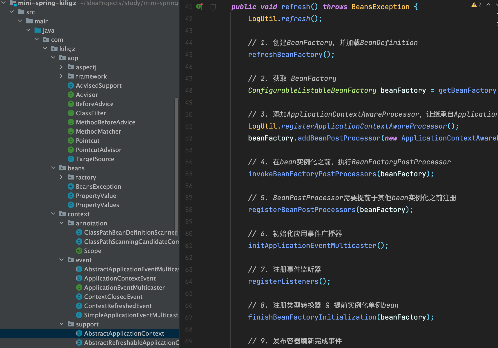
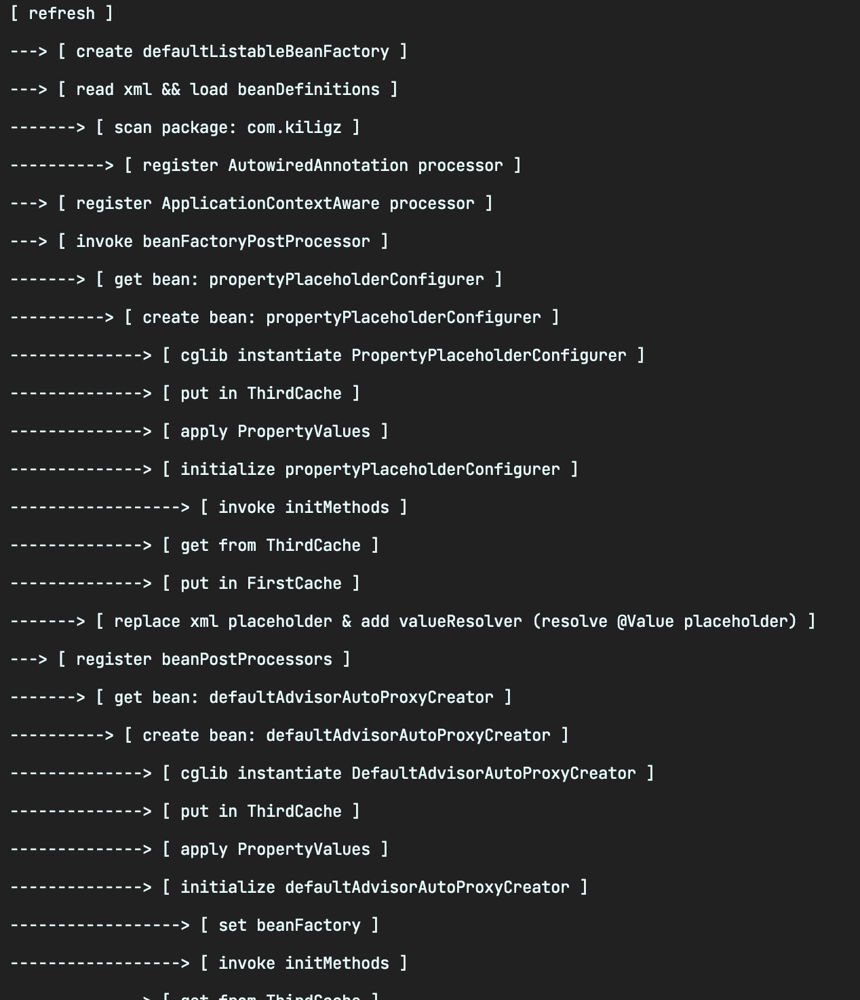

# mini-spring-kiligz
> 简化的spring框架，保留spring核心功能，相比其它注释比较详细，加入了自己的理解，加入了执行的流程，欢迎star & 提出改进


## 笔记
[Mini-Spring](./Mini-Spring.md)


## 主要分为四部分

- [IOC](./Mini-Spring.md#IOC)

- [AOP](./Mini-Spring.md#AOP)

- [扩展](./Mini-Spring.md#扩展)

- [高级](./Mini-Spring.md#高级)


## 概览







```
[ refresh ] 
---> [ create defaultListableBeanFactory ] 
---> [ read xml && load beanDefinitions ] 
-------> [ scan package: com.kiligz ] 
----------> [ register AutowiredAnnotation processor ] 
---> [ register ApplicationContextAware processor ] 
---> [ invoke beanFactoryPostProcessor ] 
-------> [ get bean: propertyPlaceholderConfigurer ] 
----------> [ create bean: propertyPlaceholderConfigurer ] 
--------------> [ cglib instantiate PropertyPlaceholderConfigurer ] 
--------------> [ put in ThirdCache ] 
--------------> [ apply PropertyValues ] 
--------------> [ initialize propertyPlaceholderConfigurer ] 
------------------> [ invoke initMethods ] 
--------------> [ get from ThirdCache ] 
--------------> [ put in FirstCache ]
-------> [ replace xml placeholder & add valueResolver (resolve @Value placeholder) ] 
---> [ register beanPostProcessors ] 
-------> [ get bean: defaultAdvisorAutoProxyCreator ] 
----------> [ create bean: defaultAdvisorAutoProxyCreator ] 
--------------> [ cglib instantiate DefaultAdvisorAutoProxyCreator ] 
--------------> [ put in ThirdCache ] 
--------------> [ apply PropertyValues ] 
--------------> [ initialize defaultAdvisorAutoProxyCreator ] 
------------------> [ set beanFactory ]
------------------> [ invoke initMethods ] 
--------------> [ get from ThirdCache ] 
--------------> [ put in FirstCache ]
-------> [ get bean: autowiredAnnotationBeanPostProcessor ] 
----------> [ create bean: autowiredAnnotationBeanPostProcessor ] 
--------------> [ cglib instantiate AutowiredAnnotationBeanPostProcessor ] 
--------------> [ put in ThirdCache ] 
--------------> [ apply PropertyValues ] 
--------------> [ initialize autowiredAnnotationBeanPostProcessor ] 
------------------> [ set beanFactory ]
------------------> [ invoke initMethods ] 
--------------> [ get from ThirdCache ] 
--------------> [ put in FirstCache ]
---> [ init ApplicationEventMulticaster ] 
--------------> [ put in FirstCache ]
---> [ register ApplicationListeners ] 
---> [ pre instantiate Singletons ] 
-------> [ get bean: a ] 
----------> [ create bean: a ] 
--------------> [ cglib instantiate A ] 
--------------> [ put in ThirdCache ] 
==================> FirstCache[]:[] | SecondCache[remove]:[] | ThirdCache[put]:[a] 
--------------> [ process PropertyValues ] 
------------------> [ process @Autowired annotation ]
--------------> [ apply PropertyValues ] 
-------> [ ref bean: b ] 
-------> [ get bean: b ] 
----------> [ create bean: b ] 
--------------> [ cglib instantiate B ] 
--------------> [ put in ThirdCache ] 
==================> FirstCache[]:[] | SecondCache[remove]:[] | ThirdCache[put]:[a, b] 
--------------> [ process PropertyValues ] 
------------------> [ process @Autowired annotation ]
--------------> [ apply PropertyValues ] 
-------> [ ref bean: a ] 
-------> [ get bean: a ] 
--------------> [ get early beanReference: a ] 
--------------> [ get from ThirdCache ] 
==================> FirstCache[]:[] | SecondCache[put]:[a] | ThirdCache[remove]:[b] 
--------------> [ initialize b ] 
------------------> [ invoke initMethods ] 
------------------> [ postProcess after initialization (autoProxy) ]
--------------> [ get early beanReference: b ] 
--------------> [ get from ThirdCache ] 
==================> FirstCache[]:[] | SecondCache[put]:[a, b] | ThirdCache[remove]:[] 
--------------> [ put in FirstCache ]
==================> FirstCache[put]:[b] | SecondCache[remove]:[a] | ThirdCache[remove]:[] 
--------------> [ initialize a ] 
------------------> [ invoke initMethods ] 
--------------> [ get from SecondCache ]
--------------> [ put in FirstCache ]
==================> FirstCache[put]:[a, b] | SecondCache[remove]:[] | ThirdCache[remove]:[] 
-------> [ get bean: b ] 
--------------> [ get from FirstCache ]
-------> [ get bean: defaultAdvisorAutoProxyCreator ] 
--------------> [ get from FirstCache ]
-------> [ get bean: autowiredAnnotationBeanPostProcessor ] 
--------------> [ get from FirstCache ]
-------> [ get bean: propertyPlaceholderConfigurer ] 
--------------> [ get from FirstCache ]
---> [ publish ContextRefreshedEvent ] 
-------> [ get bean: a ] 
--------------> [ get from FirstCache ]
-------> [ get bean: b ] 
--------------> [ get from FirstCache ]
```
